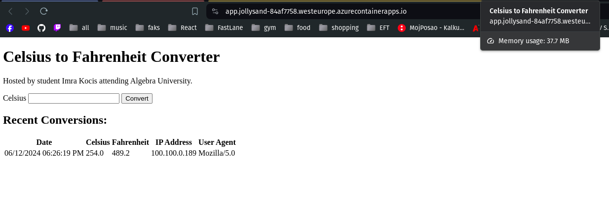
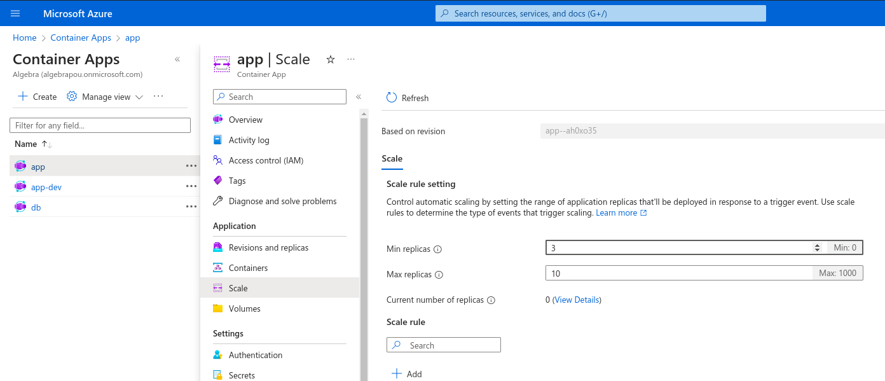
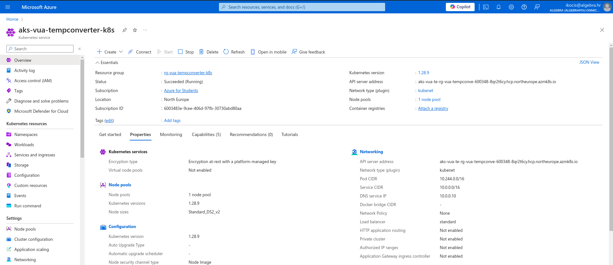
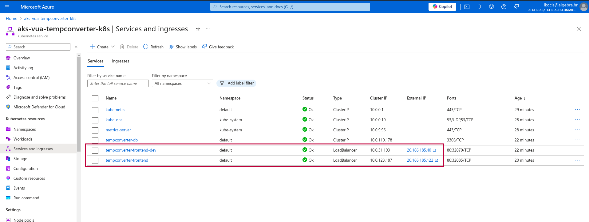

# Intro to DevOps
## Imra Kočiš
***Software Engineering,***
***June 2024***
***

### ***Content***

- [Abstract](#abstract)
- [Introduction](#introduction)
- [Solution](#solution)
  - [MySQL 8 Database and Flask Application initial setup](#mysql-8-database-and-flask-application-initial-setup)
  - [Azure Container Apps](#azure-container-apps)
    - [Building and pushing Docker image](#building-and-pushing-docker-image)
    - [Deploying to Azure Container Apps](#deploying-to-azure-container-apps)
  - [Azure Kubernetes Service](#azure-kubernetes-service)
    - [Creating Kubernetes Deployment Manifest](#creating-kubernetes-deployment-manifest)
    - [Deploying to Azure Kubernetes Service](#deploying-to-azure-kubernetes-service)
- [Conclusion](#conclusion)
- [References](#references)

***
### Abstract

The Main goal of this project is to find two solutions for containerizing flask application with MySQL database, one simple and
one complex. The First step is setting up MySQL 8 database with the appropriate environment variables.
After successful database setup, we have to containerize application using Docker and deploy it to Azure 
Container Apps as a simple solution. For a complex solution, we have to deploy database and docker images
to Azure Kubernetes Service.

***
### Introduction
This seminar paper focuses on two different solutions for containerizing flask application with MySQL database.
Both solutions are based on Azure Cloud services. The project highlights both a straightforward and a more advanced solution.
For both solutions, we will use Docker to build and push images to Docker Hub, and then deploy them to Azure Cloud services.

The First solution uses Azure Container Apps. The Azure Container Apps service enables us to run microservices and containerized
applications on a serverless platform [1](#1-httpslearnmicrosoftcomen-usazurecontainer-appsget-startedtabsbash-accessed-on-12-06-2024). With that
being said, we will deploy our flask application images to Azure Container Apps, and we will use MySQL 8 database image as well.
All of them will be deployed as external services on virtual network.

The Second solution is based on Azure Kubernetes Service. Azure Kubernetes Service (AKS) is a managed Kubernetes service that can be used to deploy and manage containerized applications. 
[2](#2-httpslearnmicrosoftcomen-usazureakswhat-is-aks-accessed-on-12-06-2024)
AKS is an ideal platform for deploying and managing containerized applications that require high availability, scalability, and portability, and for deploying applications to multiple regions, 
using open-source tools, and integrating with existing DevOps tools. [3](#3-httpslearnmicrosoftcomen-usazureakswhat-is-aks-accessed-on-12-06-2024). For this project solution we are going to 
deploy flask application images and MySQL database image to Azure Kubernetes Service.
***
### Solution

#### MySQL 8 Database and Flask Application initial setup

Since the project requirement was integration of MySQL 8 database and flask application. The First step is setting up
a database as a Docker image.

We will create `docker-compose.yml`:

```yaml
  db:
    image: mysql:8.0
    environment:
      MYSQL_ROOT_PASSWORD: rpassword
      MYSQL_DATABASE: tcdb
      MYSQL_USER: user
      MYSQL_PASSWORD: password
    ports:
      - "3306:3306"
    volumes:
      - db-data:/var/lib/mysql
```

After successful database setup, the next goal is to make Docker configuration for flask application image
and then build it.

First we have to create `Docekrfile` which will prepare our flask application image:

```dockerfile
FROM python:3.12-slim

RUN apt-get update && apt-get -y upgrade

WORKDIR /app

COPY requirements.txt requirements.txt

RUN pip install --upgrade pip && pip install -r requirements.txt

COPY . .

EXPOSE 5000

CMD [ "python3", "-m" , "flask", "run", "--host=0.0.0.0"]
```

Now we should build our application as Docker image, firstly we will create
unmodified application image with tag `:latest`, we can do that by running the following command:

```bash
docker build -t imra24/tempconverter:latest .
```

After a successful build, we can push our image to Docker Hub, but first we have to log in to Docker Hub:

```bash
docker login
```

```bash
docker push imra24/tempconverter:latest
```

When we have successful pushed Docker image, we can modify our `docker-compose.yml` file and run image 
locally to test it:

```yaml
version: '3.8'

services:
  db:
    image: mysql:8.0
    environment:
      MYSQL_ROOT_PASSWORD: rpassword
      MYSQL_DATABASE: tcdb
      MYSQL_USER: user
      MYSQL_PASSWORD: password
    ports:
      - "3306:3306"
    volumes:
      - db-data:/var/lib/mysql

  app:
    image: imra24/tempconverter:latest
    restart: always
    ports:
      - "5000:5000"
    environment:
      DB_USER: user
      DB_PASS: password
      DB_HOST: db
      DB_NAME: tcdb
      STUDENT: Imra Kocis
      COLLEGE: Algebra University
    build:
      context: .
      dockerfile: Dockerfile
    depends_on:
      - db

volumes:
  db-data:
```

We can run our application locally with command:

```bash
docekr compose up app
```
***
#### Azure Container Apps

##### Building and pushing Docker image
Before deploying our application to Azure Container Apps, we have to create modified
Docker image with tag `:dev`, to achieve that we have to make our changes in `index.html`:

```html
<!DOCTYPE html>
    
<html>
 <head>
  <title>TempConverter</title>
 </head>
</html>
```

We have to build and push new image to Docker Hub

```bash
docker build -t imra24/tempconverter:dev .
```
```bash
docker push imra24/tempconverter:dev
```

##### Deploying to Azure Container Apps

In this section, we will highly rely on Azure Container Apps documentation [4](#4-httpslearnmicrosoftcomen-uscliazurecontainerappviewazure-cli-latest-accessed-on-12-06-2024). 

Before everything, we have to log in to Azure, we will be prompt to enter our credentials in the browser

```bash
az login
```

After successful login we have to create a resource group, we will use `az group create` command.
We will follow Azure way of naming, we will use `rg-vua-tempconverter` as a name.
Where `rg` stands for a resource group, `vua` stands for University of Algebra (HR: _Veleučilište Algebra_),
and `tempconverter` is the name of the project.

```bash
az group create --name rg-vua-tempconverter --location westeurope
```

The Next step is to create a virtual network and subnet [5](#5-httpslearnmicrosoftcomen-uscliazurenetworkvnetviewazure-cli-latest-accessed-on-12-06-2024).
The reason for this is that we can't run our database application as an external service with `--transport`
set to `tcp` we will use `az network vnet create` and `az network vnet subnet update` commands

```bash
az network vnet create --resource-group rg-vua-tempconverter --name vnet-vua-tempconverter --address-prefixes 10.20.80.0/22 --subnet-name containerapps --subnet-prefixes 10.20.80.0/23
```

```bash
az network vnet subnet update --resource-group rg-vua-tempconverter --name containerapps --vnet-name vnet-vua-tempconverter --delegations Microsoft.App/environments
```

After the successful creation of virtual network and subnet, we can create Azure Container Apps environment
with `az containerapp env create` command.

```bash
az containerapp env create --name cae-vua-tempconverter --resource-group rg-vua-tempconverter --location westeurope --infrastructure-subnet-resource-id /subscriptions/6003483e-9cee-406d-97fb-30730abd80aa/resourceGroups/rg-vua-tempconverter/providers/Microsoft.Network/virtualNetworks/vnet-vua-tempconverter/subnets/containerapps
```

Probably we will gat an error saying that we are not registered for `Microsoft.OperationalInsights resource provider`,
so we have to run following command to fix it, and then try one more time to create Azure Container Apps environment.

```bash
az provider register -n Microsoft.OperationalInsights --wait
```

After successful creation of Azure Container Apps environment, we can create our database with `az containerapp create`
command. We will use mysql:8.0 image, and set environment variables for our database.

```bash
az containerapp create --name db --resource-group rg-vua-tempconverter --environment cae-vua-tempconverter --image mysql:8.0 --target-port 3306 --ingress external --transport tcp --env-vars MYSQL_ROOT_PASSWORD="rpassword" MYSQL_DATABASE="tcdb" MYSQL_USER="user" MYSQL_PASSWORD="password" --exposed-port 3306
```

Next step is to create application with `az containerapp create` command. We will use `imra24/tempconverter:latest` image

```bash
az containerapp create --name app --resource-group rg-vua-tempconverter --environment cae-vua-tempconverter --image imra24/tempconverter:latest --target-port 5000 --ingress external --env-vars DB_USER="user" DB_PASS="password" DB_HOST="db" DB_NAME="tcdb" STUDENT="Imra Kocis" COLLEGE="Algebra University"
```

We can easily check if our application is successfully running, we can do that by going to Azure Portal and navigating 
`Container Apps` -> `app` -> `Application Url`. Our result should look like this:



Deployment of `:dev` image is similar to deployment of `:latest` image, we will use same approach, but we have to change application name and use `imra24/tempconverter:dev` image.

```bash
az containerapp create --name app-dev --resource-group rg-vua-tempconverter --environment cae-vua-tempconverter --image imra24/tempconverter:dev --target-port 5000 --ingress external --env-vars DB_USER="user" DB_PASS="password" DB_HOST="db" DB_NAME="tcdb" STUDENT="Imra Kocis" COLLEGE="Algebra University"
```


To update application replicas to 3 we can use `az containerapp update` command:

```bash
az containerapp update --name app --resource-group rg-vua-tempconverter --min-replicas 3
```

Or we can update it through Azure Portal


***

#### Azure Kubernetes Service
In this section, we will highly rely on Azure Kubernetes Service documentation [6](#6-httpslearnmicrosoftcomen-uscliazureaksviewazure-cli-latest-accessed-on-12-06-2024).

For this solution we will need `kubecli` installed on our machine.

##### Creating Kubernetes Deployment Manifest

We will create `tempconverter.yml` [7](#7-httpslearnmicrosoftcomen-usazureakslearnquick-kubernetes-deploy-clideploy-the-application-accessed-on-12-06-2024) 
file, which will contain our deployment and service configuration:

```yaml
apiVersion: apps/v1
kind: Deployment
metadata:
  name: tempconverter-db
spec:
  replicas: 1
  selector:
    matchLabels:
      app: tempconverter-db
  template:
    metadata:
      labels:
        app: tempconverter-db
    spec:
      nodeSelector:
        "kubernetes.io/os": linux
      containers:
      - name: tempconverter-db
        image: docker.io/mysql:8.0
        env:
        - name: MYSQL_ROOT_PASSWORD
          value: "rpassword"
        - name: MYSQL_DATABASE
          value: "tcdb"
        - name: MYSQL_USER
          value: "user"
        - name: MYSQL_PASSWORD
          value: "password"
        ports:
        - containerPort: 3306
          name: redis
---
apiVersion: v1
kind: Service
metadata:
  name: tempconverter-db
spec:
  ports:
  - port: 3306
  selector:
    app: tempconverter-db
---
apiVersion: apps/v1
kind: Deployment
metadata:
  name: tempconverter-frontend
spec:
  replicas: 1
  selector:
    matchLabels:
      app: tempconverter-frontend
  template:
    metadata:
      labels:
        app: tempconverter-frontend
    spec:
      nodeSelector:
        "kubernetes.io/os": linux
      containers:
      - name: tempconverter-frontend
        image: docker.io/imra24/tempconverter:latest
        ports:
        - containerPort: 5000
        env:
        - name: DB_USER
          value: "user"
        - name: DB_PASS
          value: "password"
        - name: DB_HOST
          value: "tempconverter-db"
        - name: DB_NAME
          value: "tcdb"
        - name: STUDENT
          value: "Imra Kocis"
        - name: COLLEGE
          value: "Algebra University"
---
apiVersion: v1
kind: Service
metadata:
  name: tempconverter-frontend-dev
spec:
  type: LoadBalancer
  ports:
  - port: 80
    targetPort: 5000
  selector:
    app: tempconverter-frontend-dev
---
apiVersion: apps/v1
kind: Deployment
metadata:
  name: tempconverter-frontend-dev
spec:
  replicas: 1
  selector:
    matchLabels:
      app: tempconverter-frontend-dev
  template:
    metadata:
      labels:
        app: tempconverter-frontend-dev
    spec:
      nodeSelector:
        "kubernetes.io/os": linux
      containers:
      - name: tempconverter-frontend-dev
        image: docker.io/imra24/tempconverter:dev
        ports:
        - containerPort: 5000
        env:
        - name: DB_USER
          value: "user"
        - name: DB_PASS
          value: "password"
        - name: DB_HOST
          value: "tempconverter-db"
        - name: DB_NAME
          value: "tcdb"
        - name: STUDENT
          value: "Imra Kocis"
        - name: COLLEGE
          value: "Algebra University"
---
apiVersion: v1
kind: Service
metadata:
  name: tempconverter-frontend-dev
spec:
  type: LoadBalancer
  ports:
  - port: 80
    targetPort: 5000
  selector:
    app: tempconverter-frontend-dev
```

##### Deploying to Azure Kubernetes Service

Before deploying our application to Azure Kubernetes Service, we have to create a new resource group, we will use `az group create` command,
additionally we will have to use different location as before `--location` as northeurope because currently Azure Kubernetes Service is 
not available in West Europe for free subscription.

```bash  
az group create --name rg-vua-tempconverter-k8s --location northeurope
```

The next step is to create a cluster, we will use `az aks create` command.
Additionally, we will set `--node-count` to 1, because we are using Azure free subscription.

```bash
az aks create --resource-group rg-vua-tempconverter-k8s --name aks-vua-tempconverter-k8s --node-count 1
```

After successful creation of Azure Kubernetes Service cluster, we have to get credentials for our cluster, we will use
`az aks get-credentials` command, but before that we have to install aks cli. Running following command 
will install AKS CLI.

```bash
sudo az aks install-cli
```

We will have to get credentials for our cluster with the following command:

```bash
az aks get-credentials --resource-group rg-vua-tempconverter-k8s --name aks-vua-tempconverter-k8s
```

Now credentials are set, we can deploy our application to Azure Kubernetes Service, we will use the following command
to achieve that.

```bash
kubectl apply -f tempconverter.yml
```

To increase replicas of our application to 3 we can set `replicas` to 3 in `tempconverter.yml` file and run 
`kubectl apply -f tempconverter.yml` command.

After successful deployment of our application, we should have a result like this:



To access our application, we have to get external IP address of our service, we can do that by running the following command:

```bash
kubectl get services tempconverter-frontend
```
```bash
kubectl get services tempconverter-frontend-dev
```

Or we can get it through Azure Portal navigating to `Azure Kubernetes Service` -> `aks-vua-tempconverter-k8s` -> `Services and Ingress` -> `tempconverter-frontend` or `tempconverter-frontend-dev` external IP.




Docker image with tag `:latest` deployed to Azure Kubernetes Service


Docker image with tag `:dev` deployed to Azure Kubernetes Service


Additional helper commands:

Get nodes:
```bash
kubectl get nodes
```

***
### Conclusion

This project was a great opportunity to learn about containerization and deployment of applications to Azure Cloud services.
Basic implementation of both solutions is not complicated, and both of solutions are providing some benefits.

Azure Container Apps is a great solution for simple and quick deployment of containerized applications.
However, Azure Kubernetes Service provides an ability to manage and scale high-traffic applications much easier.
For this example, Azure Container Apps is a much better solution because it is simpler and cheaper to set up and maintain
 than the Azure Kubernetes Service.

***
### References
###### 1 https://learn.microsoft.com/en-us/azure/container-apps/get-started?tabs=bash accessed on 12-06-2024
###### 2 https://learn.microsoft.com/en-us/azure/aks/what-is-aks accessed on 12-06-2024
###### 3 https://learn.microsoft.com/en-us/azure/aks/what-is-aks accessed on 12-06-2024
###### 4 https://learn.microsoft.com/en-us/cli/azure/containerapp?view=azure-cli-latest accessed on 12-06-2024
###### 5 https://learn.microsoft.com/en-us/cli/azure/network/vnet?view=azure-cli-latest accessed on 12-06-2024
###### 6 https://learn.microsoft.com/en-us/cli/azure/aks?view=azure-cli-latest accessed on 12-06-2024
###### 7 https://learn.microsoft.com/en-us/azure/aks/learn/quick-kubernetes-deploy-cli#deploy-the-application accessed on 12-06-2024
